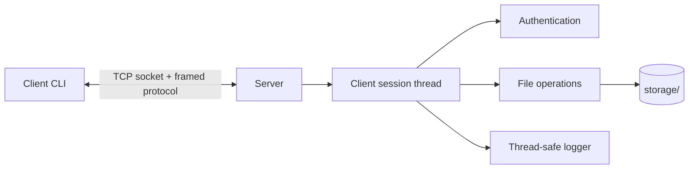

# Network File Sharing System

A small client–server file sharing application written in C++17 for Linux. It uses TCP sockets to transfer files between clients and a shared server directory, with password-hash authentication and a simple framed protocol.


## Features

- TCP client and server with multiple simultaneous client sessions
- Username/password authentication using salted SHA-512 crypt hashes
- List, upload, download, and delete files in server storage
- 100 MiB maximum file size and 1 MiB maximum protocol frame
- Filename validation, upload overwrite prevention, and symlink rejection on download/delete
- Thread-safe server logging to `server.log`

## Architecture



The server uses POSIX sockets and one thread per connected client. The Linux kernel's existing network driver moves packets for the application; this project does not implement or load a custom kernel module.

## Requirements

- Linux
- C++17 compiler (GCC or Clang)
- CMake 3.18 or newer
- OpenSSL command-line tool (for generating password hashes)
- `libcrypt` development headers and library (`libcrypt-dev` on Debian/Ubuntu, `libxcrypt-devel` on Fedora)

## Build

Run these commands from the repository root:

```sh
cmake -S . -B build
cmake --build build -j
```

This produces `build/nfs-server` and `build/nfs-client`.

## Configure users

The server reads `users.db` from its current working directory. Each line has this format:

```text
username SHA512_CRYPT_HASH
```

Create a user entry without putting the plaintext password in shell history:

```sh
read -rsp 'Password: ' NFS_PASSWORD
printf '\n'
NFS_HASH=$(openssl passwd -6 "$NFS_PASSWORD")
unset NFS_PASSWORD
printf 'pratyush %s\n' "$NFS_HASH" > users.db
chmod 600 users.db
```

Repeat the last `printf` with another username/hash to add more users. Protect `users.db` and choose a unique password. The server does not provide a user registration command.

## Start the server and connect

Start the server from the directory containing `users.db`. It creates `storage/` if needed and appends events to `server.log`.

```sh
./build/nfs-server 8080
```

In another terminal, connect using the server's hostname or IP address:

```sh
./build/nfs-client 127.0.0.1 8080
```

Enter the username and password configured above. At the `nfs>` prompt, use:

| Command | Action |
|---|---|
| `list` | List files in server storage and their sizes |
| `upload LOCAL_FILE` | Upload a local file; it is saved under its filename |
| `download REMOTE_FILE` | Download a server file into the client's current directory |
| `delete REMOTE_FILE` | Delete a file from server storage |
| `exit` | Close the client session |

Uploads with a filename already present on the server are rejected rather than overwritten. Downloads are written to the client's current directory and may overwrite a local file with the same name.

## Protocol summary

Each control message is a 4-byte unsigned length in network byte order followed by the message payload (up to 1 MiB). The payload is newline-separated. Commands are `AUTH`, `LIST`, `UPLD`, `DOWN`, `DELE`, and `QUIT`. Upload and download data follow as raw bytes; upload requests include the byte count. Responses begin with `OKAY` or `ERR!`.

## Security and limitations

- File operations are unavailable until authentication succeeds.
- Server filenames are restricted to a single path component; `.` and `..`, separators, and control separators are rejected.
- File transfers are limited to 100 MiB. Uploads cannot overwrite existing server files.
- Passwords are stored as salted SHA-512 crypt hashes, not plaintext. For a production service, use a password hashing scheme such as Argon2id or bcrypt.
- **Traffic is not encrypted.** Usernames, passwords, and file contents travel over TCP in cleartext. Run only on a trusted network; do not expose the server publicly.
- The server listens on all network interfaces. Limit access with your firewall.
- This version has no TLS, per-user file permissions, checksums, resumable transfers, quotas, or graceful server shutdown. It uses one thread per connection.

## Verification

Built with CMake and exercised locally: valid and invalid login, list, upload, download, delete, and byte-for-byte comparison of a downloaded file (including binary bytes). The server log recorded the operations.
